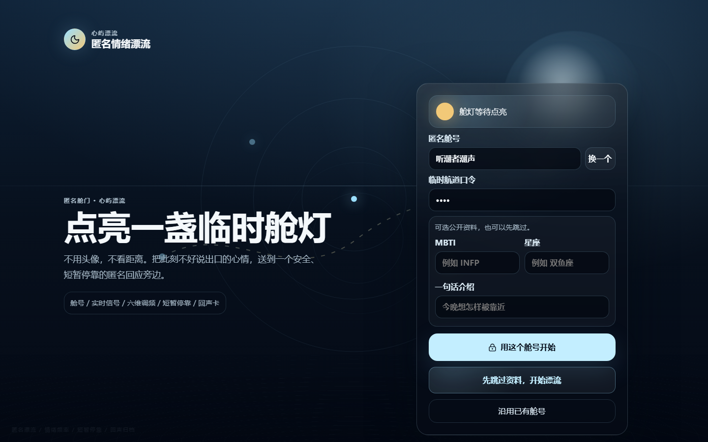
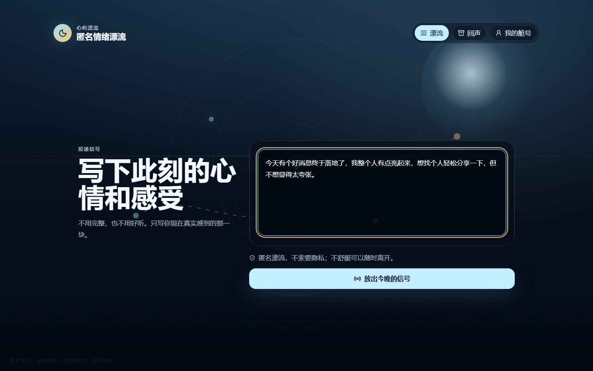
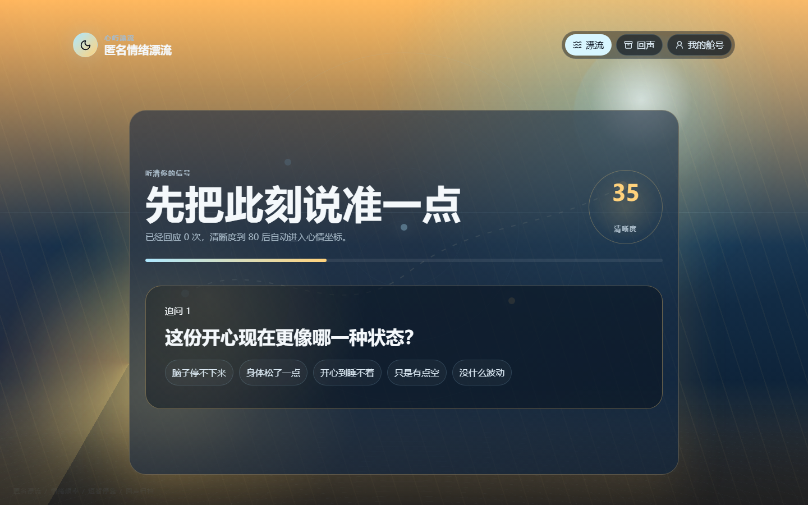
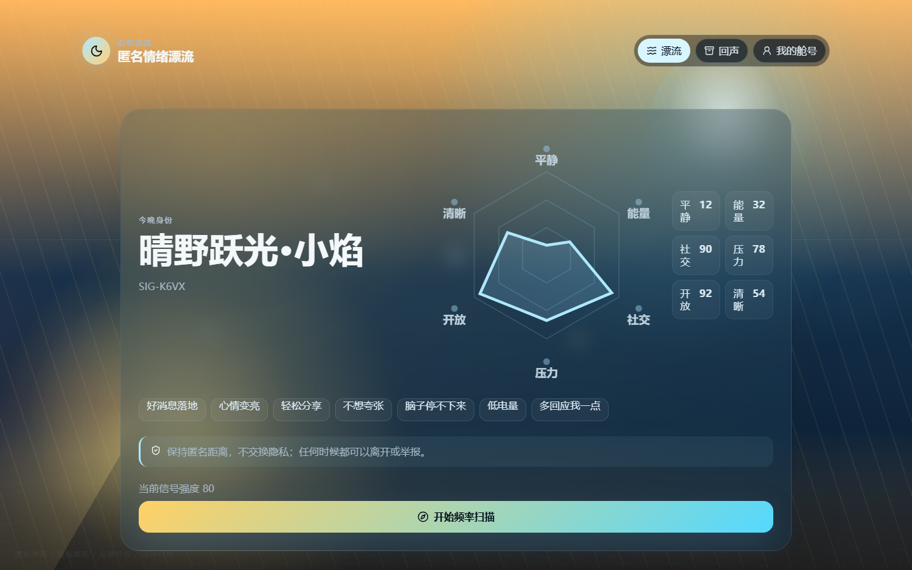
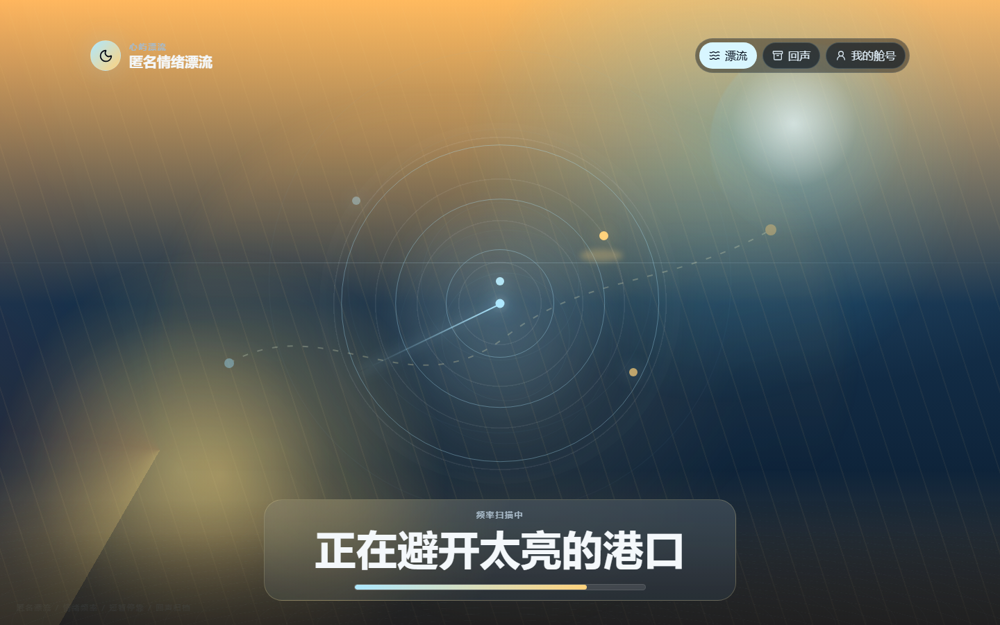
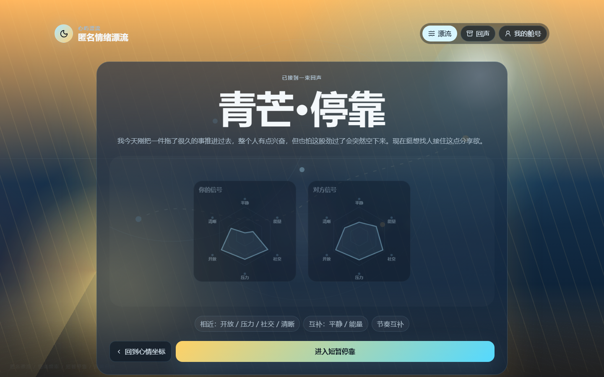
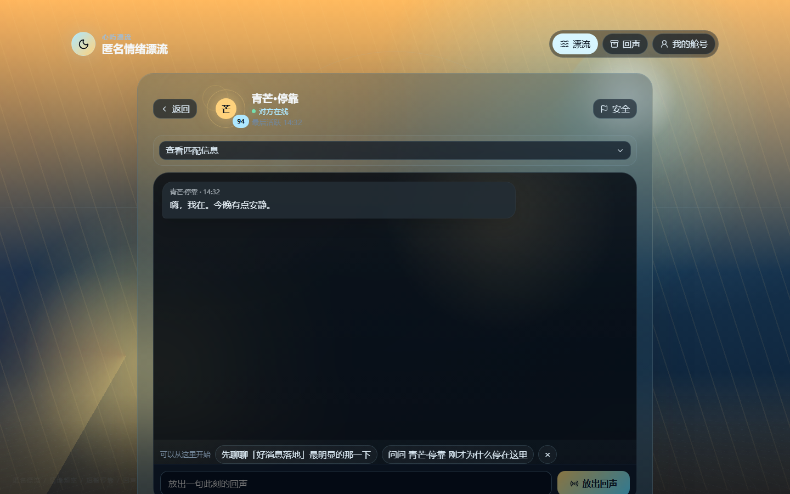
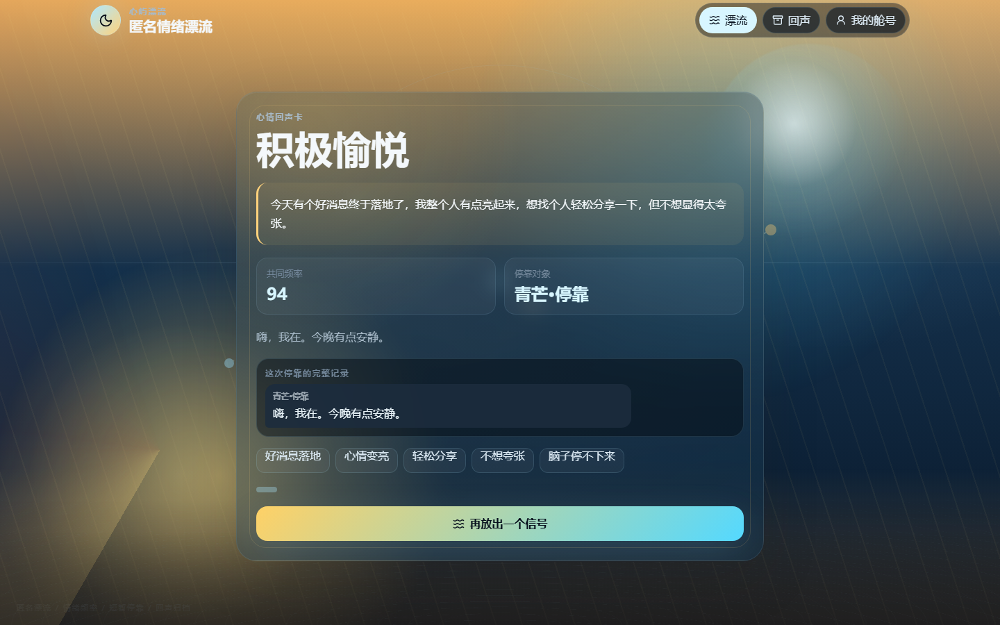

# 心屿漂流

心屿漂流是一个夜间匿名情绪漂流产品。用户写下此刻真实心情，系统用逐题追问把模糊感受校准成六维心情坐标，再寻找一个能短暂停靠的匿名对象。聊天结束后，这次相遇会被保存成一张可回看的回声卡。

> 这不是传统聊天框，也不是情绪分析报告。它的重点是匿名、安全、短暂停靠和可回看的一次情绪相遇。

## 技术路线

本仓库已经按比赛要求改为前后端分离：

- 前端：`frontend/`，Next.js App Router + React + TypeScript。
- 后端：`backend/`，FastAPI + SQLite。
- 模型接口：服务端兼容 OpenAI-compatible `/v1/chat/completions` 与 Anthropic-compatible `/v1/messages`，密钥只读取环境变量。
- 数据持久化：匿名舱号、实时心情、追问答案、匹配房间、聊天消息、回声卡、举报记录均落 SQLite。
- 前端请求：同源 `/api/...`，本地 Next.js 通过 rewrite 转发到 FastAPI。

## 核心体验

- 首次访问会生成一个匿名舱号，可填写 MBTI、星座、一句话介绍和聊天边界，也可以一键跳过。
- 首页只保留“此刻心情和感受”输入框，不用固定选项打断表达。
- 追问是一题一题自然发生，清晰度达到可匹配状态后才展示心情坐标。
- 六维分数会真实影响匹配理由、雷达重叠、破冰话题和聊天氛围，但不把加减分暴露给用户。
- 匹配优先寻找真实在线账号，5 秒内没有合适对象时进入内部兜底对象；前台不暴露技术路由。
- 聊天页支持在线状态、资料抽屉、安全举报、重新漂流、暂时离开和保存完整回声记录。

## 情绪主题

系统会根据输入识别至少六类情绪，并切换完整视觉世界：

- 兴奋/开心：朝阳漂流，暖金、珊瑚橙、清亮天蓝。
- 难过/低落：雨夜漂流，蓝紫雨幕、慢波纹、远处孤灯。
- 焦虑/紧绷：雾中雷达，冷青雾、低频扫描、降速文案。
- 疲惫/低电量：月白静港，低对比、大片留白、慢漂浮。
- 愤怒/委屈：暗红潮汐，低饱和红潮、边界更清楚。
- 孤独/混乱：星空漂流，远处灯点、匿名信号靠近。

## 预览

| 点亮舱号 | 投递心情 |
| --- | --- |
|  |  |

| 自然追问 | 心情坐标 |
| --- | --- |
|  |  |

| 频率扫描 | 雷达重叠 |
| --- | --- |
|  |  |

| 短暂停靠聊天 | 回声卡 |
| --- | --- |
|  |  |

## 本地运行

需要 Node.js 22+ 与 Python 3.11+。

### 1. 启动后端

```powershell
cd backend
python -m venv .venv
.\.venv\Scripts\pip install -r requirements.txt
.\.venv\Scripts\python -m uvicorn app.main:app --reload --host 127.0.0.1 --port 8000
```

健康检查：

```powershell
Invoke-RestMethod http://127.0.0.1:8000/api/health
```

### 2. 启动前端

```powershell
cd frontend
npm install
npm run dev
```

打开：

```text
http://127.0.0.1:3000
```

也可以在仓库根目录安装 `concurrently` 后使用：

```powershell
npm install
npm run dev
```

## 环境变量

真实密钥只放在本地或部署平台环境变量中，不提交到仓库。

```text
STEPFUN_API_KEY=your_key_here
STEPFUN_OPENAI_BASE_URL=https://api.stepfun.com/v1
STEPFUN_ANTHROPIC_BASE_URL=https://api.stepfun.com
STEPFUN_MODEL=step-3.7-flash
XINYU_DB_PATH=backend/data/xinyu-piaoliu.sqlite
NEXT_PUBLIC_API_BASE_URL=http://127.0.0.1:8000
```

如果没有模型密钥，后端会使用本地兜底逻辑保证主流程可演示；配置密钥后由 FastAPI 后端统一调用真实模型接口，前端不会显示供应商或模型名称。

## API 摘要

- `GET /api/health`
- `POST /api/auth/register`
- `POST /api/auth/login`
- `GET /api/me`
- `PATCH /api/profile`
- `POST /api/analyze`
- `POST /api/intake/answer`
- `POST /api/match/request`
- `GET /api/match/status`
- `POST /api/match/rematch`
- `GET /api/messages`
- `POST /api/messages`
- `POST /api/echo-card`
- `GET /api/echo-cards`
- `POST /api/report`
- `POST /api/rooms/leave`
- `POST /api/provider-check`

## 目录结构

```text
xinyu-piaoliu/
├─ frontend/          Next.js 前端
│  ├─ app/            App Router 页面入口
│  └─ src/            React 产品界面与视觉系统
├─ backend/           FastAPI 后端
│  └─ app/main.py     API、SQLite、匹配与模型适配
├─ doc/screenshots/   README 展示截图
└─ tests/             历史验收与浏览器流程资料
```

## 隐私与安全

仓库不包含真实 API Key、运行数据库、日志或真实用户数据。匿名聊天保留举报、暂时离开和边界提示，不引导交换外部联系方式。
