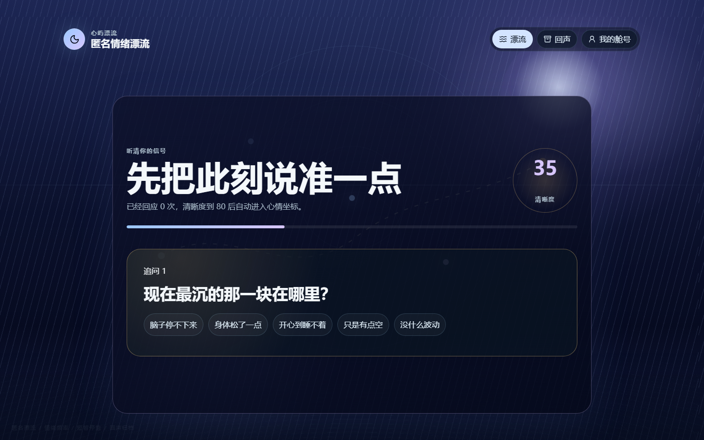
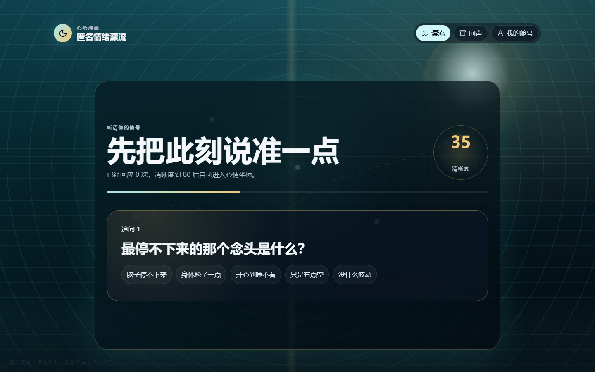
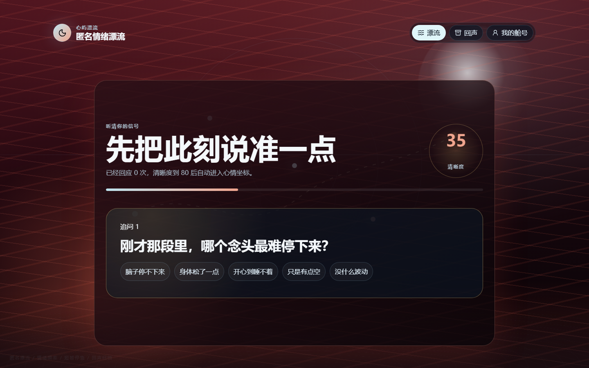
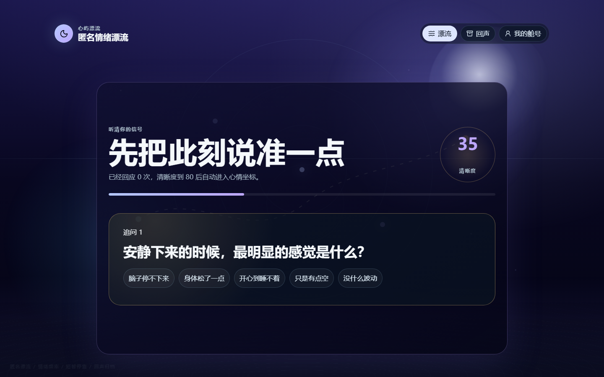

# 心屿漂流

把今晚说不清的情绪，投进一条安全航道。

心屿漂流是一个夜间匿名情绪漂流产品。用户用一个临时舱号进入，把此刻心情写成一段信号；系统会用一题一题的自然追问，把模糊状态校准成六维心情坐标，再寻找一个可以短暂停靠的匿名对象。聊完后，这次相遇会被收成一张可以回看的心情回声卡。

在线体验：[https://vibechat-production-5136.up.railway.app](https://vibechat-production-5136.up.railway.app)

> 它不是普通聊天框，也不是情绪分析报告。它想做的是：让用户在不暴露身份、不被熟人压力打扰的情况下，把某个晚上真实的情绪安全地放出来，并得到一次有边界的短暂停靠。

## 核心体验

- 临时舱号：首次访问自动生成匿名舱号，可跳过资料，也可填写 MBTI、星座、一句话介绍和聊天边界。
- 实时心情：首页只保留一段文字输入，不堆选项，让用户写“此刻的感受”。
- 动态追问：根据原文逐题追问，直到信号清晰度足够，再展示心情坐标。
- 六维调频：平静、能量、社交、压力、开放、清晰会真实影响匹配理由、话题和安全边界。
- 强情绪主题：兴奋、难过、焦虑、疲惫、愤怒、孤独/混乱会进入不同视觉世界。
- 真人优先：两个真实账号在 5 秒窗口内可进入同一房间轮询互聊；无人合适时进入内部兜底对象，界面不暴露技术路由。
- 短暂停靠：聊天页包含在线状态、正在输入、公开资料、安全举报、重新漂流和完整回声保存。
- 回声归档：保存相遇后，可回看完整聊天记录和这次心情轨迹。

## 预览

| 点亮舱灯 | 投递心情信号 |
| --- | --- |
|  |  |

| 自然追问 | 心情坐标 |
| --- | --- |
|  |  |

| 频率扫描 | 雷达重叠 |
| --- | --- |
|  |  |

| 短暂停靠聊天 | 回声卡 |
| --- | --- |
|  |  |

## 情绪氛围

| 兴奋：朝阳漂流 | 难过：雨夜漂流 |
| --- | --- |
|  |  |

| 焦虑：雾中雷达 | 愤怒：暗红潮汐 |
| --- | --- |
|  |  |

| 孤独 / 混乱：星空漂流 |
| --- |
|  |

## 评委推荐体验路径

1. 进入页面，点亮一个临时舱号，或先跳过资料。
2. 写一段此刻真实心情，例如焦虑、开心、难过、愤怒或说不清。
3. 回答逐题追问，等清晰度达到可匹配状态。
4. 查看自己的心情坐标，再开始频率扫描。
5. 进入雷达重叠页，观察相近与互补频段。
6. 进入短暂停靠聊天，发送一句消息，查看在线状态、资料抽屉和安全入口。
7. 收好这次相遇，生成回声卡。
8. 打开“回声”，回看完整聊天记录。

## 技术栈

- 前端：React 19、Vite、TypeScript、CSS 场景化视觉系统。
- 后端：Node.js、Express、SQLite。
- 数据：匿名账号、情绪记录、房间、消息、回声卡、举报记录。
- 模型接口：服务端兼容 OpenAI-style `/v1/chat/completions` 与 Anthropic-style `/v1/messages`。
- 验证：ESLint、TypeScript build、API contract、浏览器主链路、模型行为 QA、delivery-loop。

## 本地运行

需要 Node.js 22+。

```powershell
npm install
Copy-Item .env.example .env.local
npm run dev:full
```

默认地址：

- 前端：`http://127.0.0.1:5173`
- API：`http://127.0.0.1:8787`

生产单服务预览：

```powershell
npm run build
npm start
```

然后打开 `http://127.0.0.1:8787`。生产模式下 Express 会先处理 `/api/...`，再托管 `dist/`，非 `/api` 路由 fallback 到 `dist/index.html`。

## 环境变量

真实密钥只放在 `.env.local` 或部署平台环境变量里，禁止提交到仓库。

```text
STEPFUN_API_KEY=your_key_here
STEPFUN_OPENAI_BASE_URL=https://api.stepfun.com/v1
STEPFUN_ANTHROPIC_BASE_URL=https://api.stepfun.com
STEPFUN_MODEL=step-3.7-flash
XINYU_AI_MODE=real
XINYU_PORT=8787
```

页面不会展示模型名、接口名或供应商信息。`POST /api/provider-check` 可用于服务端验证两种兼容接口是否可达。

## 验证证据

本轮已通过：

```powershell
npm run lint
npm run build
npm run qa:model
```

latest delivery-loop PASS：`work/loop-runs/20260621-125200-vibechat-strong-themes-cabin-echo-realchat/overall.json`，product-maturity `100/100`。最终完成状态以最新 `overall.json` 为准。

## 目录结构

```text
xinyu-piaoliu/
├─ server/          Express API、SQLite、匹配、消息和情绪理解
├─ src/             React 前端和心屿漂流视觉系统
├─ tests/           API contract 与浏览器主链路配置
├─ scripts/         模型行为 QA
├─ doc/screenshots  README 展示截图
└─ work/            本地验证产物，不提交发布证据以外的大文件
```

## 隐私与安全

仓库不包含真实用户数据、运行数据库、日志或 API Key。匿名聊天内置举报和离开入口，不交换外部联系方式，不承诺对方身份，不把内部技术路由展示给用户。
